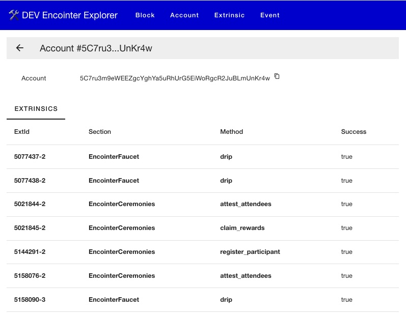
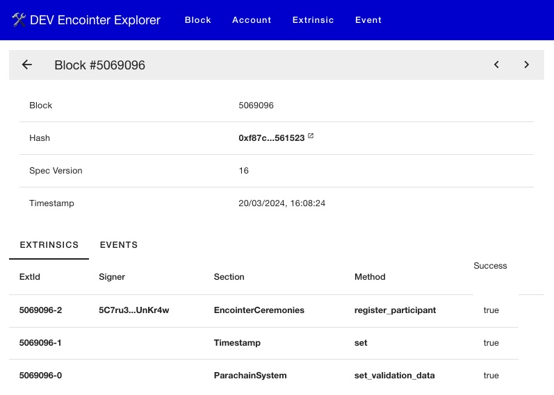
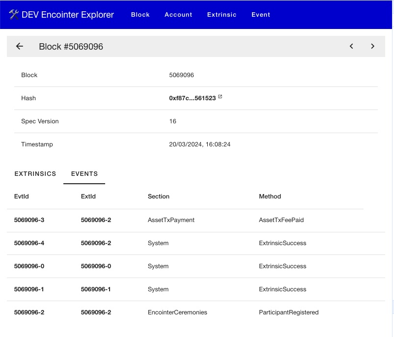
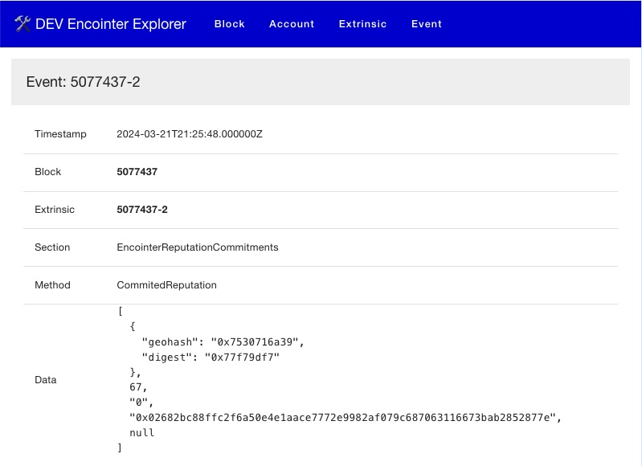

# Encointer Block Explorer

While subscan.io does not support Encointer, this repo provides a basic block explorer.

# Backend

[The backend](./backend/README.md) runs a custom subsquid indexer that stores data in Postgresql and provides the GraphQL endpoint for the frontend.

# Frontend

[The frontend](./frontend/README.md) is a Nuxt.js app that uses Apollo Client to query the GraphQL endpoint of the backend.

# Demo server

A demo server is running at [https//encointer-explorer.metaspan.io](http://encointer-explorer.metaspan.io).
\
Please note, this is a demo server and indexing may be behind the latest block.

# Screenshots

## Account Extrinsics

## Account Extrinsics

## Block Events

## Event CommittedReputation

## Event Transfer

